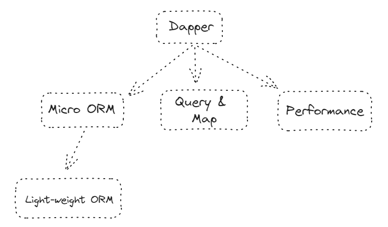
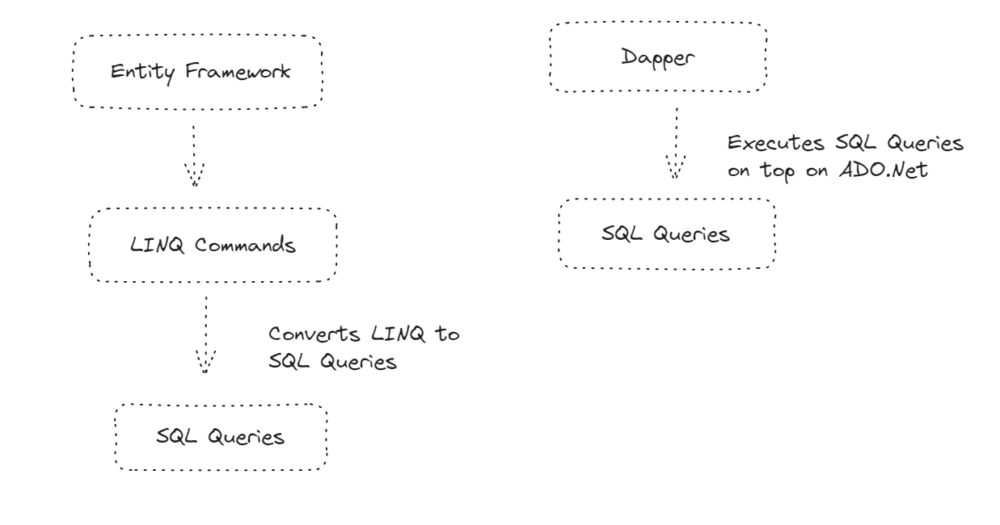

### This repository contains my learning on Dapper.

## Dapper

Dapper is a micro-ORM(Object Relational Mapping) which helps us to interact interact with relational entities(tables) into objects.It's like thin layer on top the ADO.Net.Focuses more on peformance and Query & Mapping.

### What is ORM?

ORM - Object Relational Mapping is programming which allows the developers to interact with the database using object-oriented programming paradigms.It has features like change tracking, migrations and in-built transactions and etc. Famous example for ORM is Entity Framework.

### What is Micro-ORM?

Micro-ORM are the light-weight version of the full-fledged ORM. It focuses more on quering and mapping by compromising on features like change tracking and migrations. Dapper is one of the famous example for Micro-ORM.

### Entity Framework vs Dapper

- The entity framework is a full-fledged ORM. Whereas Dapper is a micro-ORM.
- EF has features like change tracking, migrations, in-built transactions, etc. Dapper needs to rely on ADO.Net to achieve transactions.
- EF is comparitively slower than dapper.
- EF focuses more on its features. Dapper focuses more on its performance.
- EF automatically translates the LINQ commands into SQL queries. Dapper executes the queries on top of ADO.Net.

